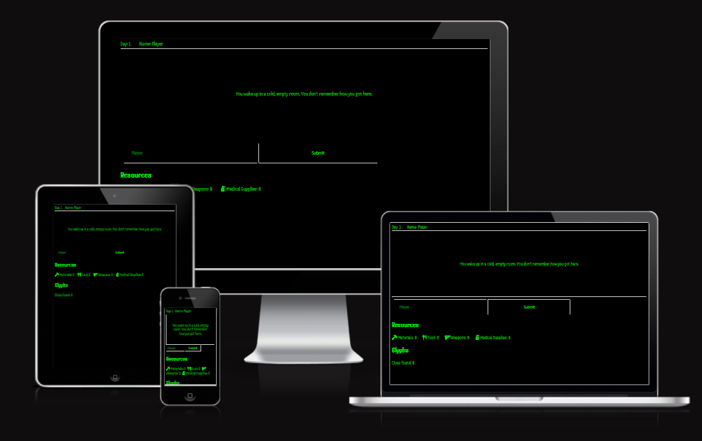
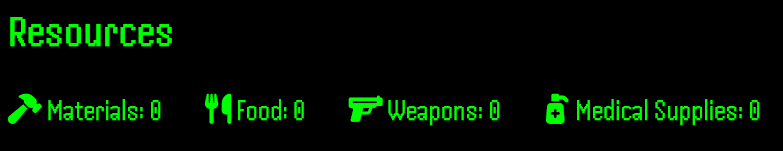
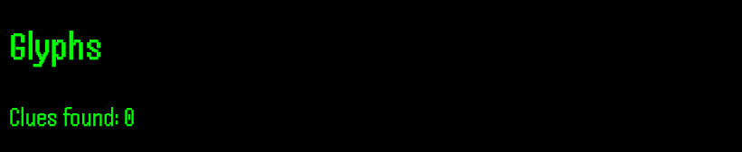
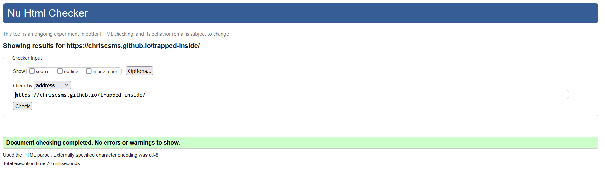
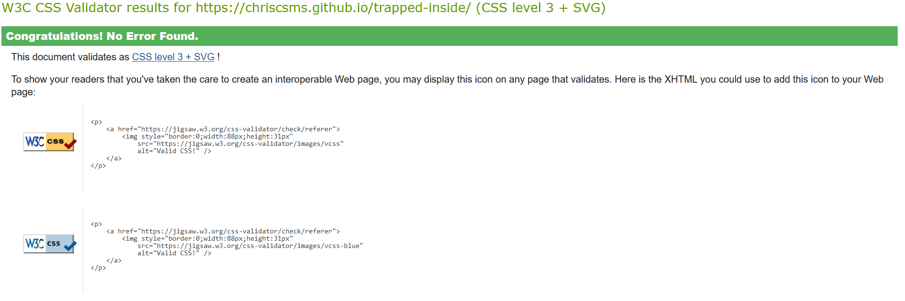
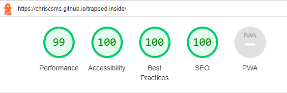
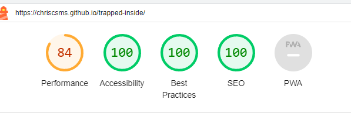
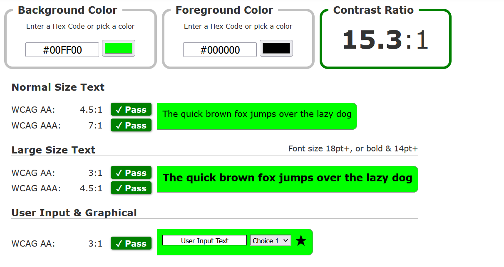

#  Trapped Inside

Trapped Inside is a horror-themed text-based exploration game. 

Players must gather resources and clues in order to complete the game. 

## Demo

A live demo of the project can be found here:

https://chriscsms.github.io/trapped-inside/

- - -

## Contents

* [User Experience](#user-experience-ux)
* [Design](#design)
* [Features](#features)
* [Technologies Used](#technologies-used)
* [Deployment and Local Development](#deployment-and-local-development)
* [Testing](#testing)
* [Credits](#credits)

- - -

# User Experience (UX)

## Initial Discussion

A gaming company wants to create a text based survival game.

### Key Information

* What is a text-based game?
* What is the story?
* What are the gameplay mechanics?

## User Stories

### Client Goals

* To make the game accessible across all devices.
* To allow players to easily understand how to play.
* The player is rewarded for interactivity.

### First Time Visitor Goals

* I want to learn the controls easily.
* I want to understand the UI being displayed. 

## Returning Visitor Goals

* I want to continue where I stopped playing before. 
* I want to find out something new within the game. 

## Frequent Visitor Goals 

* I want to check for any new or updated gameplay. 
* I want to complete the game.

# Design 

## Colour Scheme

The colour scheme chosen is based on depictions of hacking in media.

It gives the game a retro feel and makes up for the lack of images.

## Typography

Google Fonts was used to import the fonts for this project.

Handjet was chosen as it compliments the retro look and colours.

- - -

# Features

The webpage for the game is composed of a gaming window, buttons and sections which hold information for the player.

### Game Window/Active Text Area

The game window takes the players central view and is the largest element of the web page. 

### Player Controls

The player controls consists of several buttons which change depending on the choices the player makes. 

### Resource Area

An area of the webpage containing any important information relevant to the player.

### Glyphs Area

An area of the webpage which shows how many "Glyphs" or "Clues" the player has found.

- - - 

## Accessibility

To allow for the site to be more accessible:

* The code is written using semantic html.
* The colours are contrasted accurately.
* The game is text-based (easy to play).

## Future Implementations

* A way of recording data that would allow players to continue where they left off.
* Language options for the game.
* More in-game events and areas to explore.

# Technologies Used 

## Languages Used

HTML, CSS and Javascript were used to build this game and webpage.

## Frameworks, Libraries and Programs Used

* Git - For version control.
* Github - To save and store files for the website.
* Google Fonts - To import usable fonts to the website.
* Font Awesome - To import usable icons to the website.
* Google Dev Tools - For testing, troubleshooting and solving errors in code. 
* Am I Responsive? - To view the website on different devices as an image.

# Deployment and Local Development

## Deployment

The site is deployed using GitHub Pages - [Trapped Inside](https://chriscsms.github.io/trappedinside/)

1. Login or Signup to GitHub.
2. Go to the repository for the project, https://github.com/ChrisCSMS/trappedinside.
3. Find the settings button in the navigation bar and click.
4. In the left section, under "Code and automation", find the pages section and click. 
5. In the branch section, under "Build and deployment", click on the select branch dropdown and click main and the save. 
6. The site should now be deployed and might take a few minutes to be live.  

## Local Development

### How to Fork
- - -
To fork this repository:

1. Login or Signup to GitHub. 
2. Go to the repository for the project, https://github.com/ChrisCSMS/trappedinside.
3. Click the fork button in the top-right corner.

### How to Clone
- - -
To clone this repository:

1. Login or Signup to GitHub. 
2. Go to the repository for the project, https://github.com/ChrisCSMS/trappedinside.
3. Click on the code button, select which option to clone with, HTTPS, SSH or GitHub CLI and copy the link.
4. Open the terminal in your code editor and change the current working directory location to a new one for the copied directory.
5. Type git clone into the terminal followed by the link copied in step 3 and press enter.

# Testing 

Chrome Developer Tools was used to test the site during its development to recognize and source any issues and to resolve them.

## Automated Testing

The code was passed through the W3C validator for HTML and the W3C Validator for CSS without any errors.

Lighthouse within Chrome Developer Tools was also used to test performance on desktop and mobile.

#### Desktop

#### Mobile

A colour contrast test was ran to ensure readability.

## Manual Testing 

As a user:

* Page loads and everything is visible.
* Buttons are responsive to being clicked. 
* Buttons give the appropriate and expected response.
* Name submit allows the player to choose a name. 
* Text is clear and readible.

- - -

# Credits

## Content 

All content was written by myself.

## Acknowledgements

I would like to acknowledge the help I recieved in developing this project.

* Slack Community, for advice and recommendations.
* W3Schools for their helpful tutorials. 
* Code Institute Love Maths project which prepared me for this project. 